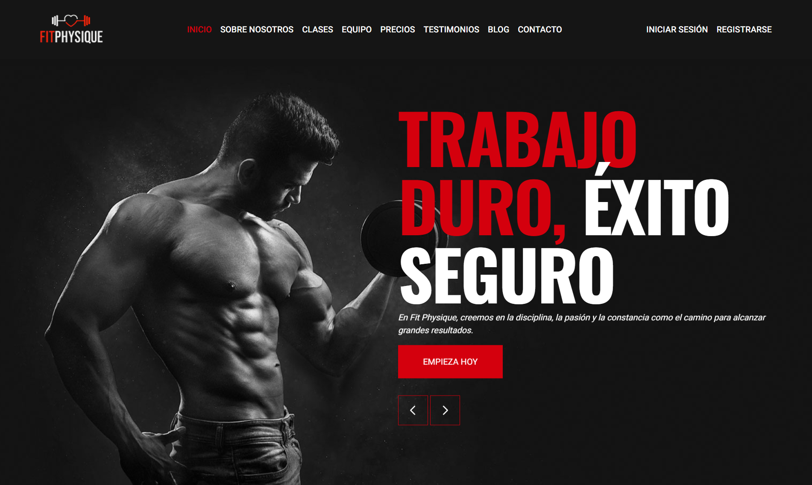

# 🏋️‍♂️ FIT PHYSIQUE · Tu mejor versión 💪

[](fit-physique-phi.vercel.app)

Bienvenido a **Fit Physique**, tu espacio digital para inspirarte, entrenar y alcanzar tu mejor versión.
Creemos en la **disciplina, la constancia y la comunidad** como pilares fundamentales para transformar no solo tu cuerpo, sino también tu vida.

Con un diseño moderno, animaciones fluidas y contenido enfocado en motivación y estilo de vida fitness, **Fit Physique** está pensado para acompañarte en cada paso hacia tus metas. 🚀

---

## 🌟 Características Principales

- 🏃 **Sección de héroe interactiva** con slider motivacional.
- 🎨 **Diseño limpio y moderno**, optimizado con Tailwind CSS.
- 📱 **Totalmente responsive**, adaptado a móviles, tablets y escritorio.
- ✨ **Animaciones fluidas con Framer Motion**, que aportan dinamismo a la experiencia.
- 📖 **Blog integrado** con artículos de motivación, energía y trabajo en equipo.
- 🚀 **Rendimiento optimizado con Next.js 15 y Turbopack**, garantizando velocidad y fluidez.

---

## ❓ ¿Por qué Fit Physique?

El nombre **Fit Physique** refleja nuestra visión:

- **Fit** = Estar en forma, con energía y salud.
- **Physique** = El resultado del esfuerzo y la constancia, un cuerpo fuerte y equilibrado.

Nuestro objetivo es **impulsarte a lograr tu mejor versión** con una plataforma motivadora, moderna y accesible.

---

## 🛠️ Tecnologías Utilizadas

## 🛠️ Tecnologías Utilizadas 👨‍💻

| HTML | CSS | JavaScript | React | TypeScript | Tailwind CSS | Next.js | Node.js | ESLint |
|------|-----|------------|--------|-------------|---------------|--------|---------|--------|
|  |  |  |  |  |  |  |  |  |

---

## 🚀 Instalación y Uso Local

Sigue estos pasos para clonar y ejecutar el proyecto en tu máquina local:

1. **Clona el repositorio:**
   ```bash
   git clone https://github.com/carlossilvadev10/fit-physique.git
   ```

2. **Entra en el directorio del proyecto:**

   ```bash
   cd fit-physique
   ```

3. **Instala las dependencias necesarias:**

   ```bash
   npm install
   ```

4. **Ejecuta la aplicación en entorno de desarrollo:**

   ```bash
   npm run dev
   ```

5. **Abre tu navegador y visita:**

   ```bash
   http://localhost:3000
   ```

---

## 📩 Contacto

Si tienes alguna pregunta o sugerencia, puedes encontrarme en:

- 🌐 [Mi GitHub](https://github.com/carlossilvadev10)
- 📧 Email: [carlos.esilva1007@gmail.com](mailto:carlos.esilva1007@gmail.com)
- 💼 [Mi LinkedIn](https://www.linkedin.com/in/carlos-eduardo-silva-bustamante-b6084528b?utm_source=share&utm_campaign=share_via&utm_content=profile&utm_medium=android_app)

---

💡 **Fit Physique** es más que un proyecto: Es una **invitación a superar tus límites** y trabajar en tu **mejor versión**.